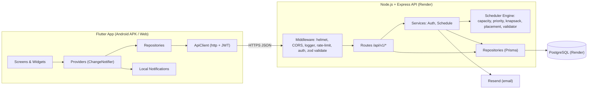
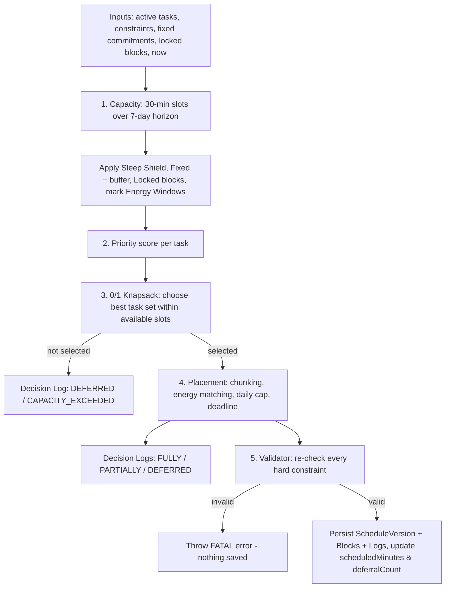
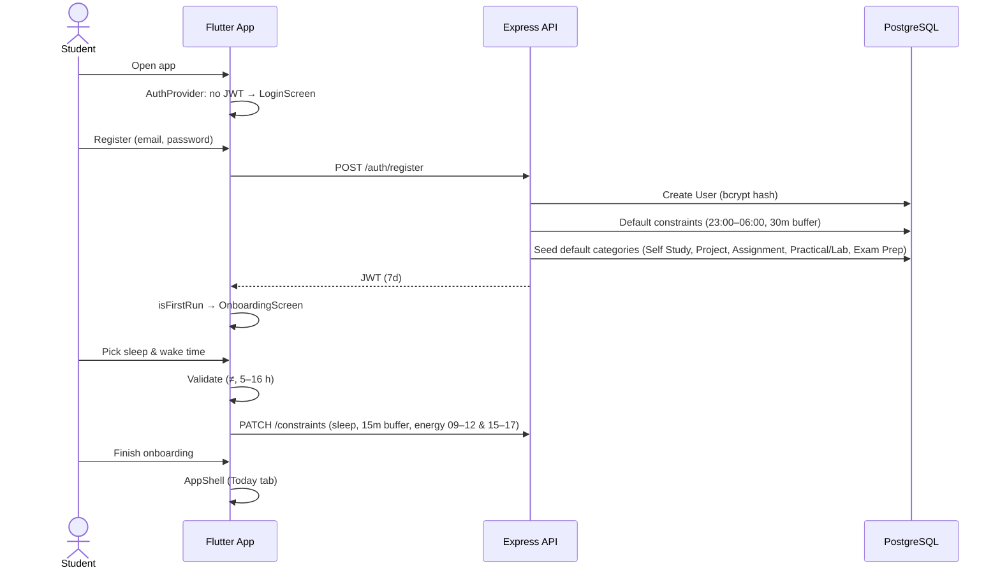
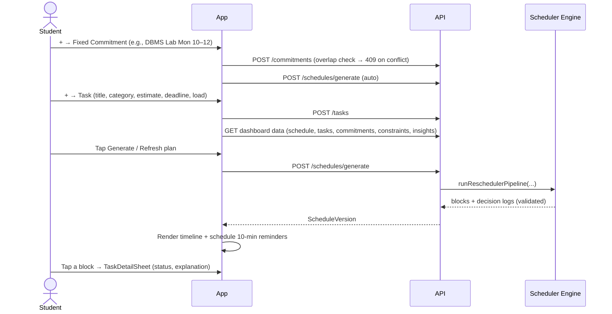
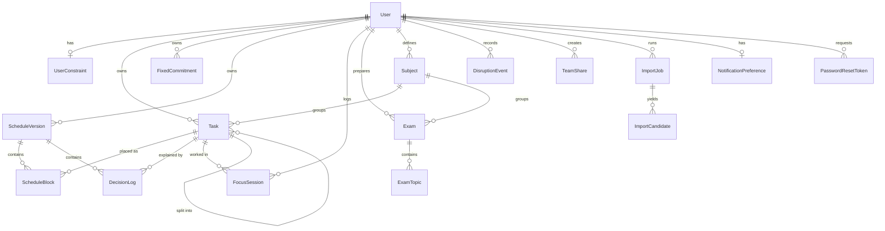
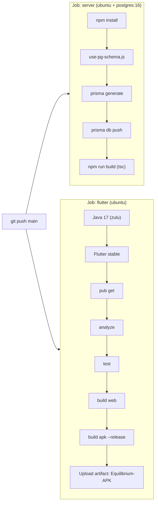

# Equilibrium — Complete Project Documentation

> **Course:** DTPLM (Design Thinking & Product Lifecycle Management) — Capstone Project
> **Repository:** `shreeK05/Equilibrium`
> **Status:** MVP deployed (Render backend + Android APK via GitHub Actions)
> **Document basis:** Written from the current source code on `main` (commit `65b0bab`), not from earlier specs.

---

## Table of Contents

1. [What is Equilibrium?](#1-what-is-equilibrium)
2. [The Problem & Design Thinking Rationale](#2-the-problem--design-thinking-rationale)
3. [Feature Catalogue](#3-feature-catalogue)
4. [System Architecture](#4-system-architecture)
5. [Tech Stack](#5-tech-stack)
6. [Repository Structure](#6-repository-structure)
7. [The Scheduling Engine (Core IP)](#7-the-scheduling-engine-core-ip)
8. [User Flows](#8-user-flows)
9. [Mobile App — Screens & Navigation](#9-mobile-app--screens--navigation)
10. [Data Model](#10-data-model)
11. [REST API Reference](#11-rest-api-reference)
12. [Security](#12-security)
13. [Testing](#13-testing)
14. [CI/CD & Deployment](#14-cicd--deployment)
15. [Local Development Setup](#15-local-development-setup)
16. [Known Limitations & Open Issues](#16-known-limitations--open-issues)
17. [Future Roadmap](#17-future-roadmap)
18. [Glossary](#18-glossary)

---

## 1. What is Equilibrium?

**Equilibrium** is an **autonomous academic workload optimizer** for college students. Instead of being a passive to-do list, it **builds the student's study schedule for them** using a constrained optimization algorithm.

Its core promise:

| Promise | How it is delivered |
|---|---|
| **Never sacrifice sleep** | A hard-constraint *Sleep Shield* — no task block may ever be placed inside the sleep window. |
| **Respect fixed life** | Classes, labs, exams and routines are *Fixed Commitments* (with a buffer around them) that the scheduler works around. |
| **Do the most important work first** | Each task gets a *priority score* (academic weight, urgency, team impact, deferral debt) and a 0/1 Knapsack picks the best set that fits. |
| **Match work to energy** | `HIGH` cognitive-load tasks are placed in *Peak Energy Windows* first. |
| **Be honest about overload** | If work doesn't fit, it is *deferred* with a written explanation — never silently squeezed into sleep. |
| **Explain every decision** | Every run produces *Decision Logs* with the score breakdown and a human-readable reason. |

---

## 2. The Problem & Design Thinking Rationale

### 2.1 Problem Statement
Students juggle assignments, labs, projects, exam prep and fixed classes. Typical tools (calendars, to-do apps, reminders) **record** work but don't **decide** when to do it. The result is last-minute cramming, all-nighters and burnout.

### 2.2 Design Thinking Stages

| Stage | Outcome in Equilibrium |
|---|---|
| **Empathize** | Students over-commit, under-estimate tasks, and treat sleep as the "elastic" resource. |
| **Define** | *"How might we let a student see — and trust — a realistic plan that never costs them sleep?"* |
| **Ideate** | Auto-scheduler with hard sleep constraint; explainability; what-if simulation; focus timer that feeds real progress back. |
| **Prototype** | Earlier prototypes: Python/FastAPI backend (`equilibrium_backend/`) and React Native app (`equilibrium_rn/`). |
| **Test / Iterate** | Final stack: Node.js + TypeScript backend and Flutter app. UI iterated on real-device feedback (overflow fixes, single Category dropdown, stable date navigator, named fixed blocks). |

---

## 3. Feature Catalogue

### 3.1 Core (MVP)

| # | Feature | Description |
|---|---|---|
| F1 | **Account & Auth** | Email/password register & login (JWT, 7-day expiry). Forgot/reset password via email link + app deep link. |
| F2 | **Onboarding** | First-run flow that captures the sleep window and seeds default energy windows (09:00–12:00, 15:00–17:00) and a 15-min buffer. |
| F3 | **Sleep Shield** | User-defined sleep start / wake-up. Hard constraint enforced in the scheduler *and* re-checked by a validator. Editable in Profile. |
| F4 | **Tasks** | Title, description, **Category** (single dropdown), estimate (minutes), deadline, cognitive load (LOW/MEDIUM/HIGH), academic weight, team-impact weight, optional daily cap. |
| F5 | **Fixed Commitments** | Classes, labs, exams, personal events, routines. Overlap-checked on create/update. Shown on the timeline with their real titles. |
| F6 | **Auto Schedule Generation** | One tap produces a 7-day plan in 30-minute granularity. |
| F7 | **Timeline View** | "Today" and "Next few days" views with absolute-positioned blocks, sleep-shield overlay, and current-time indicator. Tapping a block opens task details. |
| F8 | **Decision Logs / Explainability** | Per-task outcome (`FULLY_SCHEDULED`, `PARTIALLY_SCHEDULED`, `DEFERRED`), reason code, score components, and a plain-English sentence. |
| F9 | **Reschedule** | Re-plans from the current version, preserving locked (past) blocks and linking to the previous version for history. |
| F10 | **Task Completion & Status** | Complete with actual minutes; status auto-derived (`PENDING` → `IN_PROGRESS` → `COMPLETED`); detail sheet shows `SCHEDULED` when blocks exist. |

### 3.2 Extended (V2)

| # | Feature | Description |
|---|---|---|
| F11 | **Focus Timer** | Start / pause / resume / complete / discard sessions, optionally linked to a task. Completed time is added to the task's `completedMinutes`; large over/under-runs are logged as *Disruption Events*. |
| F12 | **Exam Prep Mode** | Create exams with topics (REVISION, PYQ, MOCK_TEST, LEARNING, WEAK_TOPIC), confidence and estimates. "Schedule topics" converts topics into real tasks (academic weight 0.9; mock tests = HIGH load). |
| F13 | **What-if Simulation** | `POST /schedules/simulate` tests whether a proposed task would fit *without saving anything*. |
| F14 | **Task Splitting** | Split a task into N parts (parent archived, children inherit properties). |
| F15 | **Dashboard & Insights** | Today's planned/completed/focus minutes, overdue & due-soon counts, exam countdowns, completion rate, workload risk level. |
| F16 | **Deferral Debt Ledger** | Tasks ordered by how often they've been deferred; debt also raises priority in future runs. |
| F17 | **Local Notifications** | "Starting soon" reminder 10 minutes before each scheduled task block (Android/iOS). Toggleable. |
| F18 | **Imports** | Syllabus (PDF or text) → candidate tasks for user confirmation; `.ics` calendar → fixed commitments. *(Backend ready.)* |
| F19 | **Team Share** | Generate a read-only, expiring (1–168 h), revocable link to your schedule. Also rendered as a web page at `/team/:token`. |
| F20 | **Profile & Theme** | Name, college, degree, branch, semester; Light / Dark / System theme. |
| F21 | **Offline Indicator** | A "Working offline" pill appears when the API is unreachable. |

---

## 4. System Architecture



**Architectural style:** layered monolith — `routes → services → scheduler (pure functions) → repositories → Prisma → PostgreSQL`.
The scheduler is **pure and deterministic** (no DB access, `now` injected), which makes it unit-testable and explainable.

---

## 5. Tech Stack

### 5.1 Backend (`/server`)

| Concern | Technology |
|---|---|
| Runtime / Language | Node.js 20, TypeScript 5.9 |
| Web framework | Express 4 (+ `express-async-errors`) |
| ORM / DB | Prisma 5.22 → PostgreSQL 16 (prod & CI); SQLite option for local dev via schema-swap script |
| Validation | Zod 4 |
| Auth | `jsonwebtoken` (JWT), `bcrypt` (cost 10) |
| Security middleware | `helmet`, `cors`, `express-rate-limit` |
| Logging | Custom correlation-ID + request logger (`morgan` available) |
| Email | Resend (password reset) |
| File parsing | `pdf-parse` (syllabus import) |
| Testing | Jest 30, ts-jest, Supertest |
| Dev tooling | `tsx watch` |

### 5.2 Mobile / Web App (`/equilibrium_app`)

| Concern | Technology |
|---|---|
| Framework | Flutter (Dart SDK ^3.10) |
| State management | `provider` (ChangeNotifier); `flutter_riverpod` is a dependency but not the primary pattern |
| Networking | `http` |
| Persistence | `shared_preferences` (JWT, onboarding flag, notification prefs) |
| UI / Motion | Material 3, `google_fonts`, `flutter_animate`, `fl_chart`, Cupertino icons |
| Dates / TZ | `intl`, `timezone`, `flutter_timezone` |
| Notifications | `flutter_local_notifications` |
| Deep links | `app_links` (`equilibrium://reset-password?token=…`) |
| Branding | `flutter_launcher_icons` (adaptive icon, bg `#0A1628`) |

### 5.3 Infrastructure

| Concern | Technology |
|---|---|
| API hosting | Render Web Service (`render.yaml`) — `https://equilibrium-42g8.onrender.com/api/v1` |
| Database | Render PostgreSQL (free plan) |
| CI/CD | GitHub Actions (`.github/workflows/ci.yml`) |
| APK distribution | GitHub Actions artifact `Equilibrium-APK` |
| Web build | `flutter build web` in CI (README references Netlify hosting) |

---

## 6. Repository Structure

```
Equilibrium CP/
├── .github/workflows/ci.yml      # CI: server build + Flutter analyze/test/web/APK
├── render.yaml                   # Render blueprint (API + Postgres)
├── README.md
├── server/                       # ★ Production backend
│   ├── prisma/
│   │   ├── schema.prisma         # Data model
│   │   └── migrations/           # baseline, scheduled_minutes, password_reset
│   ├── scripts/use-pg-schema.js  # Swaps Prisma provider to PostgreSQL for CI/prod
│   ├── src/
│   │   ├── app.ts / server.ts / config.ts / db.ts
│   │   ├── middleware/           # auth, error, logger, rate-limit, validate
│   │   ├── routes/               # 15 routers (auth, tasks, schedules, …)
│   │   ├── controllers/          # commitments.controller.ts
│   │   ├── services/             # auth.service.ts, schedule.service.ts
│   │   ├── repositories/         # task, schedule, commitment, constraint, user
│   │   ├── scheduler/            # ★ capacity, priority, knapsack, placement, validator, rescheduler
│   │   └── validation/schemas.ts # Zod schemas
│   └── test/                     # Jest suites
├── equilibrium_app/              # ★ Production Flutter client
│   └── lib/
│       ├── main.dart             # Providers, theme, auth gate, deep links
│       ├── core/{api,state,theme}
│       ├── models/               # task, schedule, commitment, exam, focus_session, …
│       ├── services/             # repositories + notification_service
│       ├── screens/              # auth, onboarding, today, schedule, tasks, exams, commitments, timer, profile, insights, routines
│       └── widgets/              # cards, forms (sheets), layout, status, timeline
├── docs/  SS/                    # Supporting docs & screenshots
├── equilibrium_backend/          # Legacy Python prototype (not deployed)
└── equilibrium_rn/               # Legacy React Native prototype (not deployed)
```

---

## 7. The Scheduling Engine (Core IP)

Location: [`server/src/scheduler/`](server/src/scheduler/)
Entry point: `runReschedulerPipeline(tasks, constraints, fixed, lockedBlocks, horizonStart, horizonEnd, now)`

### 7.1 Pipeline Overview



### 7.2 Step 1 — Capacity (`capacity.ts`)
- **Horizon:** 7 days starting at **IST midnight** of the current day (`schedule.service.ts`).
- **Slots:** horizon divided into **30-minute slots** (7 × 48 = 336 slots).
- **Constraints applied** (slot → `available = false`):
  1. **Sleep Shield** for every day, including windows that cross midnight (e.g., 23:00 → 07:00) and the previous night's spill-over.
  2. **Fixed Commitments** expanded by `bufferMinutes` before and after.
  3. **Locked blocks** (past, immutable chunks during a reschedule).
- **Energy windows** set `energyBonus = true` on matching slots.

### 7.3 Step 2 — Priority (`priority.ts`)

```
score = α·academicWeight + β·(1 / (hoursToDeadline + 1)) + γ·teamImpact + δ·min(deferralCount / 5, 1)
```

| Symbol | Component | Weight |
|---|---|---|
| α | Academic weight (0–1) | **2.0** |
| β | Urgency (hyperbolic in hours to deadline) | **1.5** |
| γ | Team impact (0–1) | **1.0** |
| δ | Deferral debt (capped at 5 deferrals) | **1.0** |

Deferral debt is the **anti-starvation** mechanism: a task deferred repeatedly gains priority until it gets scheduled.

### 7.4 Step 3 — 0/1 Knapsack (`knapsack.ts`)
- **Capacity W** = number of available future slots.
- **Item weight** = `ceil(remainingMinutes / 30)` (capped at W).
- **Item value** = priority score.
- Classic DP table `dp[i][w]`, **O(n · W)** time; back-tracking yields the selected set.
- **Deterministic tie-breaking:** priority ↓, deadline ↑, academic weight ↓, id ↑ — the same input always gives the same plan.

### 7.5 Step 4 — Placement & Splitting (`placement.ts`)
For each selected task, in descending priority:
- **Chunk size:** 30 min (min) to **4 h** (max, 8 slots) of contiguous free slots.
- **Energy matching:** `HIGH` cognitive load → pass 1 only in energy-window slots, pass 2 anywhere.
- **Validity per slot:** available, not in the past, ends before the task's deadline, under the task's **daily cap** (`dailyTargetMinutes`) if set.
- Tasks are **split automatically** across multiple chunks/days when needed.
- **Decision log reason codes:**

| Outcome | Reason code | Meaning |
|---|---|---|
| `FULLY_SCHEDULED` | `SUCCESS` | All remaining minutes placed. |
| `PARTIALLY_SCHEDULED` | `DAILY_TARGET_PACING` | Held back by the task's daily cap. |
| `PARTIALLY_SCHEDULED` | `FRAGMENTED_CAPACITY` | Sleep/fixed blocks left too little contiguous space before deadline. |
| `DEFERRED` | `NO_AVAILABLE_SLOTS` | Selected, but no valid slot before deadline. |
| `DEFERRED` | `CAPACITY_EXCEEDED` | Not selected by knapsack — out-prioritized. |

### 7.6 Step 5 — Validator (`validator.ts`)
A **safety net**: independently re-checks every TASK block for:
- positive duration, task exists, ends before deadline;
- **no overlap with sleep** (today's or the previous night's window);
- **no overlap with fixed commitments + buffer**;
- total scheduled ≤ remaining (rounded up to 30 min);
- **no self-overlap** between blocks.

If any check fails, the pipeline **throws** and nothing is persisted — a broken plan can never reach the user.

### 7.7 Persistence (`schedule.repo.ts`)
In one DB transaction:
1. Create `ScheduleVersion` (trigger: `MANUAL` / `DISRUPTION`, `previousVersionId` for history).
2. Create all `ScheduleBlock`s and `DecisionLog`s.
3. Update each active task's `scheduledMinutes`.
4. Increment `deferralCount` for every `DEFERRED` or `PARTIALLY_SCHEDULED` task.

### 7.8 Worked Example
Task: *DBMS Assignment*, academic 0.8, team 0.0, 48 h to deadline, deferred once.
- academic = 2.0 × 0.8 = **1.60**
- urgency = 1.5 × 1/49 ≈ **0.03**
- team = **0.00**
- debt = 1.0 × 1/5 = **0.20**
- **score ≈ 1.83**

---

## 8. User Flows

### 8.1 First-Time User



### 8.2 Plan My Week (Core Loop)



> **Note:** Creating/deleting a **commitment** automatically regenerates the schedule. Creating a **task** refreshes data; the student then generates/refreshes the plan.

### 8.3 Doing the Work (Focus Timer)
1. Start timer (optionally linked to a task) → `POST /focus-sessions`.
2. Pause / resume → `PATCH /:id/pause` / `/:id/resume` (paused time is excluded).
3. Complete → `PATCH /:id/complete`:
   - elapsed minutes added to `task.completedMinutes` (capped at estimate);
   - status → `IN_PROGRESS` or `COMPLETED`;
   - a **Disruption Event** (`OVERRUN` / `EARLY_COMPLETION`) is logged if the difference exceeds 10 minutes.
4. A live timer pill appears in the app bar while a session is active.

### 8.4 Something Changed (Reschedule)
1. Student taps **Reschedule** → `POST /schedules/:id/reschedule`.
2. Engine keeps **locked** past blocks, recomputes the rest with fresh task progress.
3. New version saved with `triggerType = DISRUPTION` and `previousVersionId` → a **change summary** compares old vs new.

### 8.5 Exam Preparation
1. Create exam (title, date, venue, optional subject) → add topics with estimate & confidence.
2. Tap **Schedule topics** → each incomplete topic becomes a task (deadline = exam date, academic weight 0.9).
3. Regenerate the schedule → topics appear on the timeline; dashboard shows countdown & coverage %.

### 8.6 Forgot Password
1. `POST /auth/forgot-password` → always returns a generic message (no account enumeration).
2. If the user exists: random 32-byte token, **SHA-256 hash stored**, 15-min expiry, emailed via Resend.
3. Email link → `GET /auth/reset-redirect?token=…` → mobile page with **"Open Equilibrium"** → `equilibrium://reset-password?token=…`.
4. App deep-link handler opens `ResetPasswordScreen` → `POST /auth/reset-password` (token marked used in a transaction).

### 8.7 Share With Team
1. `POST /team/shares` → returns a one-time plaintext token (only its hash is stored), 1–168 h expiry.
2. Teammates open `GET /team/shares/:token` (JSON) or `/team/:token` (web page) — **read-only**.
3. Owner revokes via `DELETE /team/shares/:id`.

---

## 9. Mobile App — Screens & Navigation

### 9.1 App Gate (`main.dart`)
```
AuthStatus.initial        → loading spinner
AuthStatus.unauthenticated → LoginScreen (→ Forgot / Reset password)
isFirstRun                 → OnboardingScreen
otherwise                  → AppShell
```
A `401` from any API call triggers `forceLogout()` globally.

### 9.2 AppShell — Bottom Navigation

| Tab | Screen | Purpose |
|---|---|---|
| ☀️ Today | `TodayScreen` | Today's blocks, metrics, Sleep Shield card, refresh |
| 📅 Schedule | `ScheduleScreen` | Timeline; "Today" / "Next few days"; stable date navigator |
| ☰ Tasks | `TasksScreen` | Master task list, status badges, details |
| 📖 Exams | `ExamsScreen` | Exams, topics, confidence, schedule topics |
| 📌 Locked | `CommitmentsScreen` | Fixed commitments list / edit / delete |

**App bar:** live focus-timer pill · refresh (Today/Schedule) · profile avatar → `ProfileScreen`.
**FAB (+):** Quick-add sheet → *Task* · *Start Timer* · *Fixed Commitment*.

### 9.3 Key Bottom Sheets (`widgets/forms/`)
| Sheet | Purpose |
|---|---|
| `CreateTaskSheet` | New task — full-width **Category** dropdown (Subject removed to fix overflow) |
| `TaskDetailSheet` | Status (incl. derived `SCHEDULED`), progress, complete / split / delete |
| `CreateCommitmentSheet` / `CommitmentDetailSheet` | Add / view fixed commitments |
| `RoutineBuilderSheet` | Build recurring routines |
| `ExplanationSheet` | Decision-log explanation & score breakdown |

### 9.4 Timeline Widgets (`widgets/timeline/`)
`timeline.dart`, `timeline_grid.dart`, `timeline_block_absolute.dart` (tappable via `HitTestBehavior.opaque`, shows custom titles for FIXED blocks), `sleep_shield_absolute.dart`, `current_time_indicator.dart`.

### 9.5 Design System (`core/theme/`)
Tokens for spacing/radius/durations, typed color scheme with dedicated `sleepShield` indigo (`#4F46E5` light / `#6366F1` dark), Google Fonts typography, light & dark themes.

---

## 10. Data Model



### 10.1 Key Entities

| Model | Important fields |
|---|---|
| **User** | email (unique), passwordHash, timezone, name/college/degree/branch/semester, themePreference |
| **UserConstraint** | minSleepHours, sleepStart/sleepEnd (`"HH:mm"`), bufferMinutes, peakEnergyWindowsJson |
| **Task** | title, description, category, estimateMinutes, completedMinutes, scheduledMinutes, dailyTargetMinutes, deadline, deadlineType, academicWeight, teamImpactWeight, cognitiveLoad, deferralCount, status, parentTaskId |
| **FixedCommitment** | title, startTime, endTime, type (CLASS/LAB/EXAM/PERSONAL/CUSTOM/ROUTINE), recurrence, daysOfWeek, flexibility, color, isActive |
| **ScheduleVersion** | triggerType, capacityMinutes, algorithmVersion, previousVersionId, generatedAt |
| **ScheduleBlock** | taskId?, startTime, endTime, durationMinutes, blockType (TASK/SLEEP/FIXED/BUFFER), isCompleted, isLocked |
| **DecisionLog** | decisionType, priorityScore, priorityComponentsJson, reasonCode, humanReadable |
| **FocusSession** | taskId?, startedAt, endedAt, elapsedSeconds, status, pausedAt, totalPausedMs |
| **Exam / ExamTopic** | examDate, venue / estimateMinutes, confidence, topicType, isCompleted, linkedTaskId |
| **DisruptionEvent** | type (OVERRUN/EARLY_COMPLETION/MISSED/NEW_FIXED_EVENT), planned vs actual minutes |
| **TeamShare / PasswordResetToken** | tokenHash (unique), expiresAt, revokedAt / usedAt |

All user-owned records cascade-delete with the user. Indexes exist on hot paths (`userId+status`, `versionId+startTime`, etc.).

---

## 11. REST API Reference

Base URL: `https://equilibrium-42g8.onrender.com/api/v1` · All routes except auth/health/share-view require `Authorization: Bearer <JWT>`.
Errors use the shape `{ "error": { "code": "...", "message": "..." } }`.

| Area | Method & Path | Purpose |
|---|---|---|
| Health | `GET /health` | Liveness (used by Render health check) |
| Auth | `POST /auth/register` · `POST /auth/login` | Create account / sign in → JWT |
| | `POST /auth/forgot-password` · `POST /auth/reset-password` | Password reset |
| | `GET /auth/me` · `GET /auth/reset-redirect` | Current user / email-to-app bridge page |
| Tasks | `GET/POST /tasks` · `GET/PATCH/DELETE /tasks/:id` | CRUD |
| | `POST /tasks/:id/complete` · `POST /tasks/:id/split` | Complete with actual minutes / split |
| | `GET /tasks/debt-ledger` | Deferral debt list |
| Schedules | `POST /schedules/generate` | Run engine & save new version |
| | `POST /schedules/simulate` | What-if (not saved) |
| | `POST /schedules/:id/reschedule` | Re-plan preserving locked blocks |
| | `GET /schedules/current` · `/history` · `/:id` · `/:id/decisions` | Read plans & logs |
| Constraints | `GET/PATCH /constraints` | Sleep, buffer, energy windows |
| Commitments | `GET/POST /commitments` · `GET/PATCH/DELETE /commitments/:id` | Fixed commitments (409 on overlap) |
| Focus | `POST /focus-sessions` · `PATCH /:id/{pause,resume,complete,discard}` · `GET /` · `GET /active` | Focus timer |
| Exams | `GET/POST /exams` · `GET/PATCH/DELETE /exams/:id` | Exams |
| | `POST /exams/:id/topics` · `PATCH/DELETE /exams/:examId/topics/:topicId` | Topics |
| | `POST /exams/:id/schedule-topics` | Topics → tasks |
| Subjects | `GET/POST /subjects` · `PATCH/DELETE /subjects/:id` | Categories |
| Dashboard | `GET /dashboard` | Aggregated metrics |
| Insights | `GET /insights` | Capacity vs workload, risk level |
| Profile | `GET/PATCH /profile` | Profile & theme |
| Notifications | `GET/PATCH /notifications/preferences` | Alert toggles |
| Imports | `POST /imports/syllabus` · `POST /imports/syllabus/:jobId/confirm` · `POST /imports/calendar/ics` | Syllabus / ICS import |
| Team | `POST /team/shares` · `GET /team/shares/:token` · `DELETE /team/shares/:id` | Read-only sharing |
| Web share | `GET /team/:token` *(outside `/api/v1`)* | HTML view of shared schedule |

---

## 12. Security

| Control | Implementation |
|---|---|
| Password storage | bcrypt, cost factor 10 |
| Sessions | Stateless JWT (HS256), 7-day expiry; client stores in `shared_preferences` |
| Authorization / IDOR | Every query is scoped by `userId` from the JWT (`findFirst({ id, userId })`, `updateMany({ id, userId })`) |
| Brute force | Auth routes rate-limited: 20 requests / 15 min / IP |
| Input validation | Zod schemas via `validate()` middleware; 1 MB JSON limit; 5 MB PDF / 2 MB ICS limits |
| HTTP hardening | `helmet` security headers; configurable CORS (`ALLOWED_ORIGINS`) |
| Reset tokens | 32-byte random, SHA-256 hashed at rest, 15-min expiry, single-use, generic response |
| Share tokens | 32-byte random, hashed at rest, expiring, revocable, read-only payload |
| XSS (server HTML) | Token HTML-escaped in reset-redirect page |
| Observability | Request correlation IDs + request logging; central error handler |

---

## 13. Testing

### 13.1 Backend (Jest)
| Suite | Focus |
|---|---|
| `scheduler.test.ts` | Core engine: sleep shield, knapsack selection, placement, validator |
| `scheduler.extended.test.ts` | Edge cases: midnight-crossing sleep, daily caps, fragmentation, determinism |
| `api.test.ts` | Endpoint behaviour (Supertest) |
| `security.test.ts` | Auth, IDOR, rate-limit, validation |
| `autonomy.integration.test.ts` / `extended.integration.test.ts` | End-to-end planning flows |
| `regression.student-workflow.test.ts` / `v3.regression.test.ts` | Real student scenarios / regressions |
| `team-web.test.ts` | Share links & web view |

Commands: `npm test` (scheduler config) · `npm run test:api` (full suite, needs a DB).

### 13.2 Flutter
`flutter analyze` + `flutter test` (`test/widget_test.dart`) — both run in CI.

---

## 14. CI/CD & Deployment

### 14.1 GitHub Actions (`.github/workflows/ci.yml`) — on push / PR to `main`



- `API_BASE_URL` is injected at build time via `--dart-define`.
- **Getting the APK:** GitHub → *Actions* → latest green run → *Artifacts* → **Equilibrium-APK** → unzip → install `app-release.apk`.

### 14.2 Render (`render.yaml`)
| Setting | Value |
|---|---|
| Service | `equilibrium-api` (Node, root `server/`) |
| Build | `npm ci && node scripts/use-pg-schema.js && npm run build` |
| Start | `npx prisma migrate deploy && node dist/server.js` |
| Health check | `/api/v1/health` |
| Env | `NODE_ENV=production`, `DATABASE_URL` (from DB), `JWT_SECRET` (generated), `ALLOWED_ORIGINS='*'` |
| Database | `equilibrium-db` (PostgreSQL, free plan) |

> Render free tier sleeps after inactivity — the **first request can take ~30–50 s** (the client timeout is 60 s).

---

## 15. Local Development Setup

**Prerequisites:** Node.js 20+, Flutter SDK (Dart ^3.10), PostgreSQL (or SQLite for quick local runs), Java 17 for Android builds.

```bash
# Backend
cd server
npm install
# set DATABASE_URL, JWT_SECRET (≥32 chars), optional RESEND_API_KEY
npx prisma db push
npm run dev            # http://localhost:3000/api/v1

# Frontend
cd equilibrium_app
flutter pub get
flutter run -d chrome --dart-define=API_BASE_URL=http://localhost:3000/api/v1
flutter build apk --debug   # local debug APK
```

> On this Windows machine, Application Control blocks Flutter's AOT `gen_snapshot.exe`, so **release** APKs must be built by GitHub Actions; local **debug** builds work.

---

## 16. Known Limitations & Open Issues

These were found while reading the current code for this document. They are listed honestly so they can be fixed or disclosed during evaluation.

| # | Severity | Issue | Detail | Suggested fix |
|---|---|---|---|---|
| K1 | 🔴 High | **Sleep Shield uses UTC, not IST** | Commit `eebf3e3` removed the IST offset from `capacity.ts`/`validator.ts` to make CI tests pass. `parseTimeStrToDate` uses `setUTCHours`, so a 23:00–07:00 sleep window is enforced as **04:30–12:30 IST**. Tasks can be placed during real night hours. | Convert `"HH:mm"` using the user's timezone (`User.timezone`, default `Asia/Kolkata`) and update tests to set `TZ` explicitly. |
| K2 | 🟠 Medium | **Server tests not run in CI** | Server job only builds; `npm test` was removed to get a green pipeline. | Re-add `npm test` with `TZ: Asia/Kolkata` env after fixing K1. |
| K3 | 🟠 Medium | **Edit commitment uses PUT; API only has PATCH** | `ScheduleProvider.updateCommitment` calls `PUT /commitments/:id` → 404. | Change client to `_api.patch(...)`. |
| K4 | 🟡 Low | **Recurring routines not expanded by the scheduler** | `findActive` only matches explicit `startTime/endTime`; `recurrence`/`daysOfWeek` are stored but not expanded. | Expand recurrences into instances within the horizon. |
| K5 | 🟡 Low | **Timezone hard-coded to IST** | Horizon is anchored to `Asia/Kolkata`; `User.timezone` defaults to `UTC` and isn't used. | Capture device timezone on register; use it throughout. |
| K6 | 🟡 Low | **Dashboard "today" uses server time** | `/dashboard` builds today's range with server-local time (UTC on Render). | Compute day boundaries in the user's timezone. |
| K7 | 🟡 Low | **Insights utilization mixes periods** | Compares 7-day scheduled minutes against a *daily* safe capacity. | Compare per-day, or multiply capacity by horizon days. |
| K8 | 🟡 Low | **No JWT revocation** | Password reset does not invalidate existing tokens. | Add token version counter or refresh tokens. |
| K9 | ℹ️ Info | **Render cold start** | Free tier sleeps; first call is slow. | Uptime pinger or paid instance before demos. |

---

## 17. Future Roadmap

- Fix K1–K3 (sleep timezone, CI tests, PATCH) — **pre-demo priority**.
- Per-user timezone end-to-end.
- Recurring routine expansion (RRULE).
- Import UI in the app (syllabus PDF & ICS).
- Burnout analytics charts over time (focus vs planned, deferral trends).
- Server-side push notifications and daily brief.
- Google Calendar two-way sync.
- Play Store release with signed APK/AAB and GitHub Releases for downloads.

---

## 18. Glossary

| Term | Meaning |
|---|---|
| **Sleep Shield** | Hard constraint that blocks the sleep window from scheduling. |
| **Fixed Commitment** | Immovable event (class, lab, exam, routine) the scheduler works around. |
| **Buffer** | Minutes reserved before/after each fixed commitment. |
| **Peak Energy Window** | Time ranges preferred for HIGH cognitive-load tasks. |
| **Slot** | A 30-minute unit of schedulable time. |
| **Horizon** | The 7-day window the scheduler plans over. |
| **Priority Score** | Weighted sum of academic, urgency, team and debt components. |
| **Deferral Debt** | Priority boost earned by tasks that keep getting deferred. |
| **Decision Log** | Saved explanation of what happened to each task in a run. |
| **Schedule Version** | An immutable snapshot of one scheduler run (with history chain). |
| **Locked Block** | A past block preserved unchanged during rescheduling. |
| **Disruption Event** | Logged overrun / early completion that signals a reschedule. |
