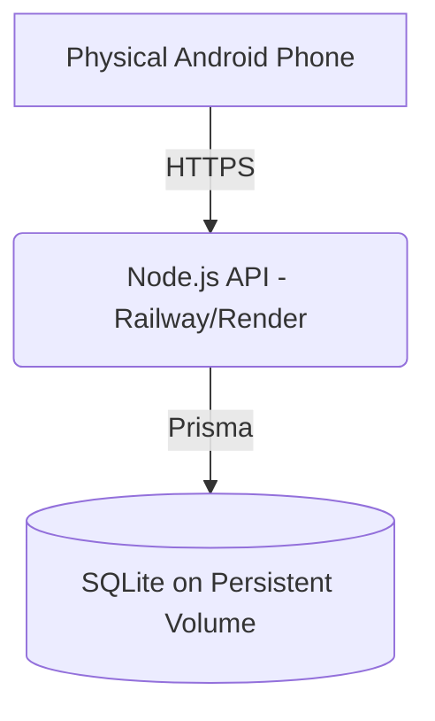

# Equilibrium Production Deployment Guide

This document outlines the deployment architecture and execution steps for bringing Equilibrium from local development to a live production environment.

## 1. Deployment Architecture
- **Client (Android APK)**: Flutter application compiled in release mode. Connects securely via HTTPS to the Backend API.
- **Backend API**: Node.js Express server running on a managed Node environment (e.g., Render, Railway, Fly.io).
- **Database**: Prisma via SQLite. Since Equilibrium handles per-user workload state locally without complex multi-region replication needs, SQLite mapped to a **Persistent Volume** on your hosting provider is perfectly suited for production.



## 2. Required Accounts & Services
- **Hosting Provider**: An account on Railway (recommended for simplest persistent volume attachment) or Render.
- **Version Control**: GitHub or GitLab repository to connect your backend codebase to the hosting provider.

## 3. Environment Variables
You must define the following variables on your hosting provider:
- `PORT`: Usually automatically assigned by the host (e.g. `8080`).
- `NODE_ENV`: `production`
- `DATABASE_URL`: The absolute path to your persistent volume mount (e.g., `"file:/data/prod.db"`).
- `JWT_SECRET`: A highly secure random string (e.g., generated via `openssl rand -hex 64`).
- `ALLOWED_ORIGINS`: The domains allowed to communicate with your API. Leave as `*` if you only have a mobile app, but restrict to your domain if deploying a web app alongside it.

## 4. Backend Deployment Steps (e.g. Railway)
1. Commit the Equilibrium codebase to your GitHub repository.
2. In Railway, click **New Project** > **Deploy from GitHub repo**.
3. Select the `server` directory (or deploy the repository root if you specify the root directory in Railway's settings).
4. **Build Command**: `npm install && npm run build`
5. **Start Command**: `npm start`
6. Add a **Volume**: Mount it to `/data` in your deployment settings.
7. Set your environment variables (especially `DATABASE_URL="file:/data/prod.db"`).
8. **Prisma Migrations**: Because it's a persistent disk, SSH into the live server via the Railway dashboard and run `npx prisma db push` (or `npx prisma migrate deploy`) to initialize the database schema on the production volume.

## 5. Flutter Production Configuration
The Flutter client has been reconfigured to ingest its base URL dynamically at compile-time. No secrets are hardcoded in the Flutter source code.

## 6. APK Build Command
Once your backend is live (e.g., `https://equilibrium-prod.up.railway.app`), build your production APK using:

```bash
flutter build apk --release --dart-define=API_BASE_URL=https://equilibrium-prod.up.railway.app/api/v1
```

## 7. Health Check
Before installing the APK, verify your backend is responsive:
`curl https://equilibrium-prod.up.railway.app/api/v1/health`
Expected output: `{"status":"ok","timestamp":"..."}`

## 8. Security Checklist
- [x] Passwords strictly hashed via `bcrypt`.
- [x] JWTs actively enforcing `userId` bounds (IDOR protection).
- [x] Database URLs and Secrets injected ONLY at the server environment level.
- [x] API errors sanitized to prevent Prisma/SQL stack trace leaks.
- [x] No `localhost` references remain actively parsed in the compiled release bundle.

## 9. Rollback Considerations
If a migration fails or a disruption breaks the timeline rendering:
- Use Prisma to rollback the schema.
- Since Equilibrium is built on `ScheduleVersion` lineages, a corrupted layout can safely be regenerated by invoking the `reschedule` endpoint, which computes a brand new lineage state and detaches the corrupted blocks.
