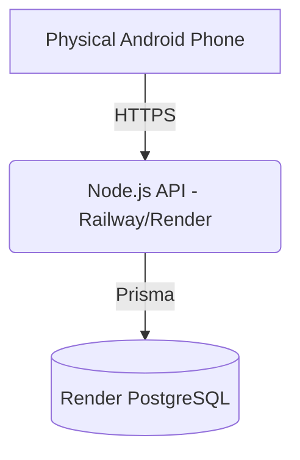

# Equilibrium Production Deployment Guide

This document outlines the deployment architecture and execution steps for bringing Equilibrium from local development to a live production environment.

## 1. Deployment Architecture
- **Client (Android APK)**: Flutter application compiled in release mode. Connects securely via HTTPS to the Backend API.
- **Backend API**: Node.js Express server running on a managed Node environment (e.g., Render, Railway, Fly.io).
- **Database**: Prisma connected to the managed PostgreSQL database attached to the Render service.



## 2. Required Accounts & Services
- **Hosting Provider**: Render Web Service connected to this GitHub repository.
- **Version Control**: GitHub or GitLab repository to connect your backend codebase to the hosting provider.

## 3. Environment Variables
You must define the following variables on your hosting provider:
- `PORT`: Usually automatically assigned by the host (e.g. `8080`).
- `NODE_ENV`: `production`
- `DATABASE_URL`: The **Internal Database URL** from the Render PostgreSQL service.
- `JWT_SECRET`: A highly secure random string (e.g., generated via `openssl rand -hex 64`).
- `ALLOWED_ORIGINS`: The domains allowed to communicate with your API. Leave as `*` if you only have a mobile app, but restrict to your domain if deploying a web app alongside it.

## 4. Backend Deployment Steps on Render
1. Connect `shreeK05/Equilibrium` to a Render Web Service.
2. Set the service root directory to `server`.
3. Set **Build Command** to `npm ci && npm run build`.
4. Set **Start Command** to `npm start`.
5. Set `DATABASE_URL` to the Render PostgreSQL **Internal Database URL**.
6. Set `NODE_ENV=production`, a random `JWT_SECRET` of at least 32 characters, and explicit `ALLOWED_ORIGINS` values.
7. `npm start` applies the Prisma schema before starting the server. For a migration-controlled production workflow, replace this with `prisma migrate deploy` after migrations are committed.

## 5. Flutter Production Configuration
The Flutter client has been reconfigured to ingest its base URL dynamically at compile-time. No secrets are hardcoded in the Flutter source code.

## 6. APK Build Command
Once your backend is live (e.g., `https://equilibrium-prod.up.railway.app`), build your production APK using:

```bash
flutter build apk --release --dart-define=API_BASE_URL=https://equilibrium-prod.up.railway.app/api/v1
```

## 7. Health Check
Before installing the APK, verify your backend is responsive:
`curl https://equilibrium-prod.up.railway.app/api/v1/health`
Expected output: `{"status":"ok","timestamp":"..."}`

## 8. Security Checklist
- [x] Passwords strictly hashed via `bcrypt`.
- [x] JWTs actively enforcing `userId` bounds (IDOR protection).
- [x] Database URLs and Secrets injected ONLY at the server environment level.
- [x] API errors sanitized to prevent Prisma/SQL stack trace leaks.
- [x] No `localhost` references remain actively parsed in the compiled release bundle.

## 9. Rollback Considerations
If a migration fails or a disruption breaks the timeline rendering:
- Use Prisma to rollback the schema.
- Since Equilibrium is built on `ScheduleVersion` lineages, a corrupted layout can safely be regenerated by invoking the `reschedule` endpoint, which computes a brand new lineage state and detaches the corrupted blocks.
